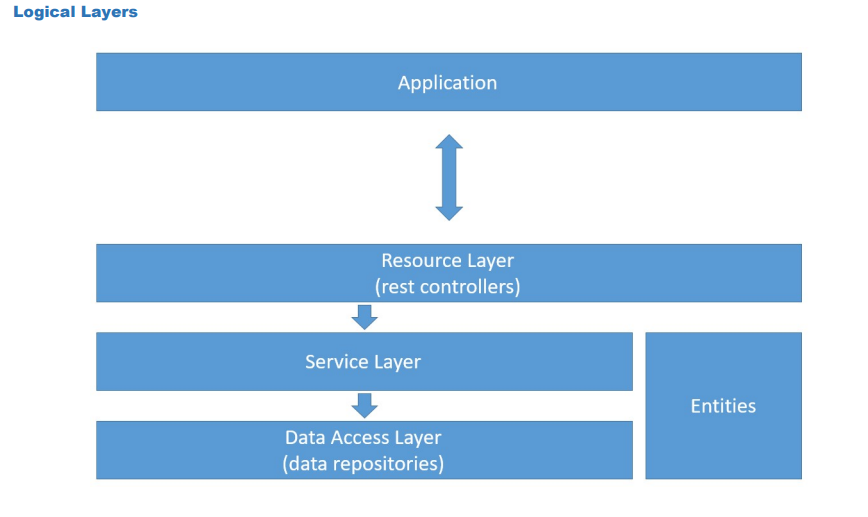

# Rest API Para Gerenciar Pessoas e endereços
### Camadas lógicas:

<div align="center">

</div>

Desenvolvi esta simples API utilizando o conceito de estrutura MVC, em camadas. Desta forma, os controllers ficam responsáveis exclusivamente de mapear os nossos endpoints, enquanto as regras de negócio ficam na camada de services, que fazem o processamento de toda requisição http recebida, se comunicando com nossos JpaRepository, que são interfaces responsáveis pelo mapeamento de objeto relacional junto aos nossos models, onde estão definidos todos os parâmetros das nossas tabelas na base de dados.
Este tipo de estrutura é fundamental para um sistema saudável, de fácil manutenção, e de boa escalabilidade. Tendo em vista que caso alguma regra mude, ou precise adicionar algo, podemos alterar apenas um método específico, que poderá ser reutilizado em várias frentes do sistema. 


## EndPoints:

Temos dois endpoints: /pessoas  e /enderecos. Todas as requisições serão feitas através destes dois endpoints, lembrando de usar : localhost:8080/api/<endpoint>. Pois nosso mapeamento de rota padrão passa por /api.
**Para casos de teste, utilize o POSTMAN ou o gerenciador de requisiçoes de sua preferência**, modelos de requisição:

### Pessoas:
```shell
{

"name": "Higo",

"birthDate": "1995-05-01"

}
```


 - **GET:** /pessoas -> Lista todas as pessoas cadastradas;
 - **GET:** /pessoas/{id} -> Retorna uma única pessoa;
 - **POST:** /pessoas -> Salva uma pessoa na base de dados, o campo "name", não pode ser vazio;
 - **PUT:** /pessoas/{id} -> Atualiza os dados da pessoa;
 - **DELETE:** /pessoas/{id} -> Remove uma pessoa da base de dados.

### Enderecos:
```shell
{

"street": "Casa",

"postalCode": "44444",

"number": "22",

"city": "jampa",

"isMain": "false"

}
```


 - **GET:** /enderecos-> Lista todos os endereços cadastrados;
 - **GET:** /enderecos/{id} -> Retorna um único endereço;
 - **POST:** /pessoas/{id}/enderecos -> Salva um endereço atribuído à pessoa que o está cadastrando. Importante lembrar que: só será possível cadastrar um endereço, se ao menos uma pessoa estiver cadastrada na base de dados (id =1), os campos são obrigatórios, exceto **"isMain"**, falaremos sobre ele ;
 - **PUT:** /enderecos/{id} -> Atualiza os dados do endereço;
 - **DELETE:** /enderecos/{id}-> Remove um endereço da base de dados
 .
## Campo isMain

O campo "isMain" recebe um valor booleano e é responsavél por detectar o endereço principal da pessoa cadastrada. Ele não é um campo obrigatório no formulário de cadastro de endereços.
No AddressService, existe um método chamado: **validateMainAddress**, este método previne duas coisas: **primeiro:** caso o formulário venha com o campo isMain setado como nulo, ele o altera e salva na base de dados como **false**, **segundo:** ele também valida, se para aquele usuário já existe um endereço principal cadastrado (setado como **true**), e caso já exista, ele retorna um erro, pois só é possível um endereço principal por pessoa.

## Testes unitários

Testes unitários não são o meu forte, **ainda**, por isso escrevi apenas alguns testes simples. Um teste para cada tipo de requisição: listar, listar por id, cadastrar, alterar e deletar. Testando os dois services Address e People.

### Autor:
Alyson Henrique do Nascimento Nunes,
Desenvolvedor WEB,
João Pessoa, PB,
24/07/2022.
